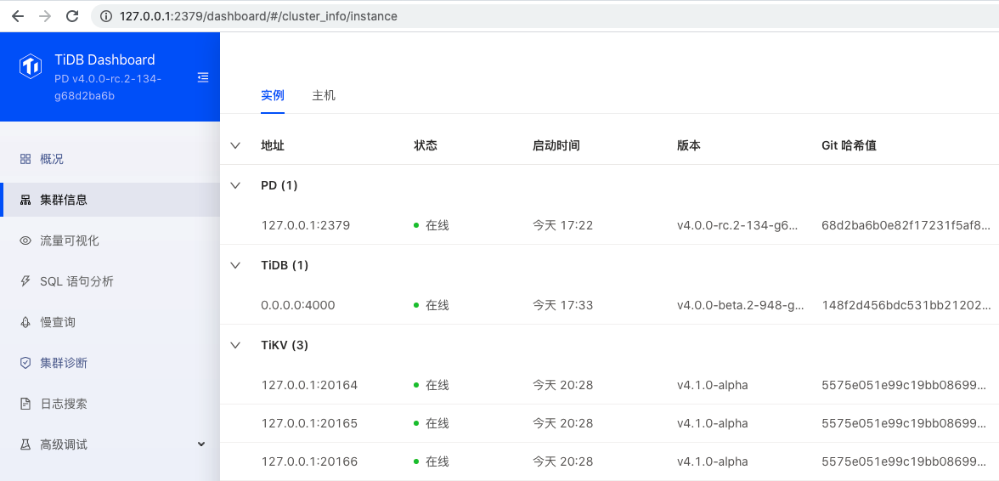
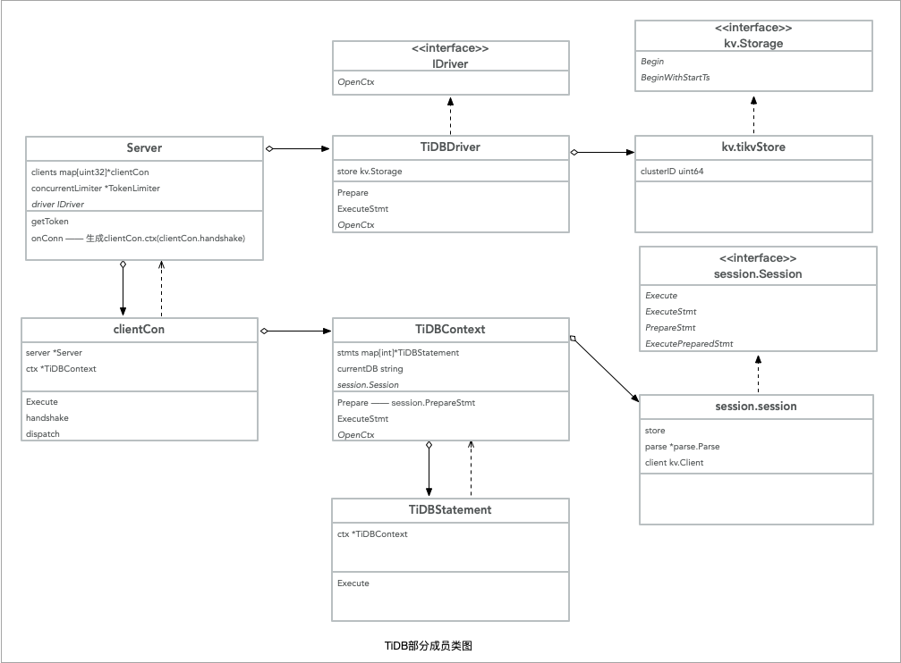

HomeWork 1
==========
### 本地下载TiDB，TiKV，PD源代码，改写源代码并编译部署以下环境：
* 1 TiDB
* 1 PD
* 3 TiKV  

改写后
* 使得TiDB启动事务时，会打一个"hello transaction"的日志

## 解答：  
#### 一、下载并编译源码
编译机器：<kbd>MacOS</kbd>、<kbd>Catalina</kbd>、<kbd>Mem 16GB</kbd>

* __编译TiDB__  
[下载TiDB](https://github.com/pingcap/tidb) clone 代码到本地，cd至根目录，执行make。编译完毕，在bin目录生成 tidb-server 可执行文件。
* __编译TiKV__  
1). [下载并安装rust](https://www.rust-lang.org/zh-CN/tools/install)，参考使用Rustup安装即可。   
2). [下载TiKV](https://github.com/tikv/tikv) 并编译  
clone 代码到本地，cd至根目录，执行make。编译完毕，在target/release目录生成 tikv-ctl、tikv-server。
* __编译PD__  
[下载PD]()，clone 代码到本地，cd至根目录，执行make。编译完毕，在bin目录生成 pd-ctl、pd-recover、pd-server。  
  
至此，TiDB、TiKV、PD 已编译完毕。

#### 二、部署TiDB环境
1. **配置启动PD**  
1）复制pd源码根目录conf/config.toml  
2) pd/bin，执行` ./pd-server -config config.toml & ` 启动pd
2. **配置启动TiKV**  
因要启动3个TiKV节点，需要配置不同的服务端口、数据目录及日志目录，写一个简单地启动脚本， 

    ```shell
	for i in `seq 3`
	do	
   		port=`expr 20163 + $i`  
    	data_dir="/data/logs/tidb/tikv-"$port
    	log_file="/data/logs/tidb/tikv-"$port".log"
    	./tikv-server --pd-endpoints="127.0.0.1:2379"  --addr="127.0.0.1:$port" --data-dir=$data_dir --log-file=$log_file
    done
	```
3. **配置启动TiDB**  
1）复制config/config.toml.example 至 bin目录，修改 store = "tikv"、path = "127.0.0.1:2379" (参数参考[命令行参数tidb-server](https://docs.pingcap.com/zh/tidb/stable/command-line-flags-for-tidb-configuration))  
2) bin目录下执行 `./tidb-server -config config.toml &` 启动TiDB 

至此，TiDB环境已部署完毕。可通过TiDB Dashboard访问查看：  

#### 三、修改源码，启动TiDB事务时，打印"hello transaction"日志
1. 分析要求，确定修改代码在TiDB工程。查阅源码，整理相关类图

2. 确定修改点 `session.go PrepareTxnCtx func`，添加日志 `logutil.Logger(ctx).Info("PrepareTxnCtx() hello transaction")`。  
3. 测试  
1）链接TiDB `mysql -uroot -Dtest -P4000`，输入 `start transaction` 输出日志：  `[2020/08/16 21:16:06.721 +08:00] [INFO] [session.go:2178] ["PrepareTxnCtx() hello transaction"]`
